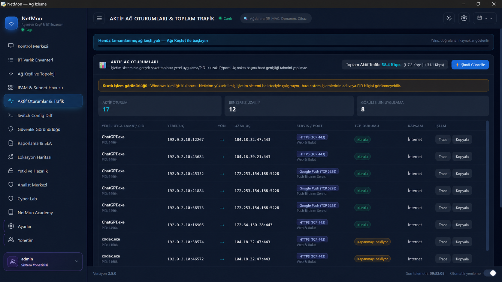
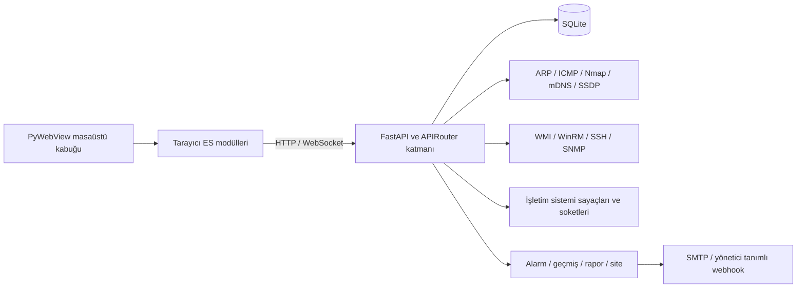

# NetMon

Yerel ağdaki cihazları keşfetmek, envanterini tutmak ve temel ağ sorunlarını tek ekrandan incelemek için geliştirdiğim bir ağ yönetim uygulaması.

[](https://github.com/AtakanTas-io/NetMon/actions/workflows/ci.yml)
[](https://github.com/AtakanTas-io/NetMon/actions/workflows/lint.yml)
[](https://github.com/AtakanTas-io/NetMon/actions/workflows/security.yml)
[](https://codecov.io/gh/AtakanTas-io/NetMon)


## Neler var?

- Nmap, ARP, mDNS, SSDP ve SNMP üzerinden cihaz keşfi
- MAC adresine göre tekilleştirilmiş cihaz envanteri
- Ping, DNS, rota ve bağlantı tanılama araçları
- WMI/WinRM ile yetkili Windows envanteri
- SNMP erişimi varsa switch port eşleştirmesi
- IPAM, IP çakışması kontrolü ve subnet doluluk görünümü
- SSH ile alınan ağ cihazı yapılandırmalarının yedeği ve farkı
- Yetkili sunucu listesine göre rogue DHCP uyarısı
- Yerel ağ arayüzü trafiği ve işletim sistemindeki aktif bağlantılar
- Kullanıcı rolleri, oturum kontrolü ve işlem kayıtları
- Kanıta dayalı alarm kuralları ile SMTP ve webhook bildirimi
- 24 saat, 7 gün ve 30 günlük operasyon geçmişi
- Zamanlanmış PDF/Excel raporları ve e-posta teslimi
- Subnet tabanlı çoklu site yönetimi
- Rol kapsamını aşamayan, süreli ve hız sınırlı API anahtarları
- Web arayüzü ve PyWebView masaüstü çalıştırma seçeneği

## Ekran görüntüsü

Aktif oturumlar ekranı, işletim sisteminin bildirdiği gerçek soketleri uygulama ve uzak uç bilgileriyle gösterir. Yerel uçlar dokümantasyon için anonimleştirilmiştir.



## Neden NetMon?

Bu tablo ürünlerin tüm yeteneklerini değil, NetMon'un kullanım sınırını açıkça göstermek için hazırlanmıştır.

| Başlık | NetMon | PRTG / SolarWinds / Domotz / Auvik |
|---|---|---|
| Lisans ve çalışma yeri | MIT lisanslı, yerelde çalışır | Ürüne göre ticari lisans ve bulut/sunucu kurulumu |
| Cihaz keşfi ve temel envanter | Var; erişilebilen protokol verileriyle sınırlı | Genellikle daha geniş cihaz şablonu ve üretici desteği |
| WMI, WinRM, SSH ve SNMP | Var; kullanıcı yapılandırması gerekir | Genellikle sihirbazlar ve hazır kimlik bilgisi kasaları bulunur |
| IPAM ve config farkı | Temel yerel görünüm var | Daha kapsamlı iş akışı, onay ve saklama seçenekleri bulunabilir |
| Bildirim ve uzun dönem geçmiş | SMTP/webhook alarmı, 30 günlük snapshot ve zamanlanmış rapor var | Genellikle daha geniş eskalasyon, çağrı zinciri ve uzun dönem saklama bulunur |
| Çoklu site ve API erişimi | Subnet tabanlı site, rol kapsamlı ve hız sınırlı API anahtarı var | Genellikle MSP tenant yapısı ve daha geniş entegrasyon kataloğu bulunur |
| Destek modeli | Topluluk ve kaynak kod | Ücretli üretici desteği ve SLA seçenekleri |

NetMon; küçük ağlarda verinin kaynağını görebilmek, yerel çalışmak ve kodu ihtiyaçlara göre uyarlamak isteyen kullanıcılar içindir. Üretici destekli SLA, çok geniş cihaz kataloğu veya hazır MSP iş akışları gerekiyorsa ticari ürünler daha uygun olabilir.

## Mimari



## Veri sınırları

NetMon erişemediği bilgiyi tahmin etmez. Donanım ve yazılım envanteri için hedef sistemde yetkili WMI, WinRM, SSH veya SNMP erişimi gerekir. Yerel ağ kartı sayaçları cihaz başına paket yakalama verisi sağlamaz. Açık bir port da tek başına güvenlik açığı olarak değerlendirilmez.

Bu ayrım arayüzde `ölçüldü`, `keşfedildi`, `yapılandırıldı` ve `kullanılamıyor` durumlarıyla gösterilir.

## Kurulum

Gerekenler:

- Python 3.11–3.13
- Windows masaüstü kullanımı için WebView2
- Kullanılacak özelliğe göre Nmap, SNMP, WMI/WinRM veya SSH erişimi

Windows'ta hızlı başlatma:

```cmd
calistir.bat
```

Elle çalıştırmak için:

```cmd
python -m venv .venv
.venv\Scripts\activate
pip install -r requirements.txt
python backend\desktop_app.py
```

İlk açılışta yönetici parolası otomatik oluşturulur ve `%USERPROFILE%\.netmon\initial_admin_password.txt` dosyasına yazılır. İlk girişte parola değişikliği istenir.

## Platform desteği

NetMon'un FastAPI sunucusu ve tarayıcı arayüzü Windows, Linux ve macOS üzerinde çalışabilir. İşletim sistemine veya harici araçlara bağlı özellikler aşağıdaki gibidir:

| Özellik | Windows | Linux | macOS | Gereksinim / sınır |
|---|:---:|:---:|:---:|---|
| FastAPI sunucusu ve web arayüzü | Evet | Evet | Evet | Python 3.11–3.13 |
| PyWebView masaüstü kabuğu | Evet | Koşullu | Koşullu | İşletim sisteminin desteklenen WebView çalışma zamanı gerekir |
| ICMP, DNS, rota ve yerel ağ keşfi | Evet | Evet | Evet | Bazı komutlar için işletim sistemi aracı ve ek yetki gerekebilir |
| Nmap keşfi ve servis taraması | Evet | Evet | Evet | `nmap` ayrıca kurulmalı ve `PATH` içinde bulunmalı |
| WMI/DCOM envanteri | Evet | Hayır | Hayır | `wmi`, `pywin32` ve hedef Windows izinleri gerekir |
| WinRM ile Windows envanteri | Evet | Hayır | Hayır | Mevcut kurulumda `pywinrm` Windows bağımlılığıdır |
| SSH envanteri ve yapılandırma yedeği | Evet | Evet | Evet | Paramiko ve hedefte yetkili SSH hesabı gerekir |
| SNMP keşfi ve switch port eşleştirmesi | Evet | Evet | Evet | Hedef cihazda SNMP ve geçerli community gerekir |
| RDP başlatma | Evet | Hayır | Hayır | Windows Uzak Masaüstü istemcisi (`mstsc.exe`) kullanılır |
| Gizli ayarların şifrelenmesi | DPAPI | Fernet | Fernet | Windows'ta kullanıcıya bağlı DPAPI; diğerlerinde yerel anahtar dosyası |

Linux ve macOS kurulumu:

```bash
python3 -m venv .venv
source .venv/bin/activate
python -m pip install -r requirements.txt
python backend/server.py
```

Windows dışındaki sistemlerde WMI, SSH ve SNMP parolaları `~/.netmon/secret.key` anahtarıyla Fernet kullanılarak şifrelenir. Anahtar dosyasının izni her kullanımda `0600` yapılır. `netmon.db` yedekleniyorsa bu dosya da güvenli ve ayrı bir konumda yedeklenmelidir; anahtar kaybolursa `fernet:` ile saklanan değerler çözülemez. Windows'taki mevcut `dpapi:` kayıtları değişmeden korunur.

## Klasörler

```text
backend/          FastAPI sunucusu ve ağ tarama modülleri
frontend/         Tarayıcı arayüzü
tests/            Pytest testleri
scripts/windows/  Başlatma, derleme ve GitHub yardımcıları
scripts/utils/    Envanter ve yönetim yardımcıları
docs/             Mimari notları ve eski test raporları
```

Kökteki `calistir.bat`, `build.bat` ve `auto-push.ps1` dosyaları `scripts/windows/` altındaki asıl komutlara yönlendirir.

## Test

```cmd
python -m pytest tests -v
```

Mevcut test paketi 182 senaryodan oluşuyor ve toplam ölçülen backend kapsamı için yüzde 70 alt sınırı uyguluyor. GitHub Actions paketi Windows ve Ubuntu üzerinde Python 3.11 ve 3.13 ile çalıştırıyor; Ruff, Mypy, Bandit ve `pip-audit` ayrı iş akışlarında denetleniyor.

## Notlar

- Planlanan işler için [ROADMAP.md](ROADMAP.md)
- Değişiklik özeti için [CHANGELOG.md](CHANGELOG.md)
- Katkı süreci için [CONTRIBUTING.md](CONTRIBUTING.md)
- Güvenlik bildirimi için [SECURITY.md](SECURITY.md)
- GitHub dal koruması ve repo kurulumu için [docs/GITHUB_KURULUM.md](docs/GITHUB_KURULUM.md)
- Kimlik doğrulama ve operasyon API örnekleri için [docs/API_ORNEKLERI.md](docs/API_ORNEKLERI.md)

MIT lisansı ile yayımlanır.
